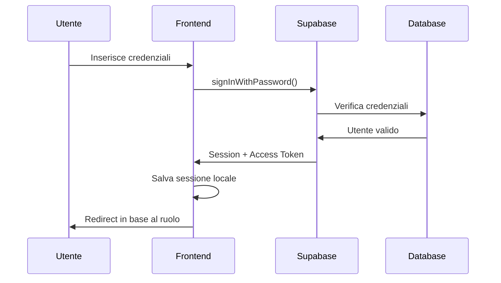

# Architettura di Autenticazione e Sicurezza

## Indice
1. [Overview](#overview)
2. [Architettura dei Client Supabase](#architettura-dei-client-supabase)
3. [Flusso di Autenticazione](#flusso-di-autenticazione)
4. [Sistema di Autorizzazione](#sistema-di-autorizzazione)
5. [Implementazione Frontend](#implementazione-frontend)
6. [Implementazione Backend](#implementazione-backend)
7. [Sicurezza delle API Routes](#sicurezza-delle-api-routes)
8. [Gestione degli Errori](#gestione-degli-errori)
9. [Best Practices](#best-practices)
10. [Troubleshooting](#troubleshooting)

---

## Overview

L'applicazione utilizza un'architettura di sicurezza a **doppio client Supabase**:
- **Client pubblico** per il frontend (chiave anonima)
- **Client admin** per il backend (chiave service role)

Questa separazione garantisce che le operazioni privilegiate avvengano solo server-side, mantenendo le chiavi sensibili al sicuro.

### Principi Fondamentali

1. **Separazione delle Responsabilità**: Frontend e backend usano client diversi
2. **Autenticazione Centralizzata**: Tutti i token vengono verificati server-side
3. **Autorizzazione Granulare**: Controllo admin a livello di API route
4. **Sicurezza per Design**: Chiavi private mai esposte al browser

---

## Architettura dei Client Supabase

### Client Pubblico (`lib/supabase.ts`)

```typescript
import { createClient } from '@supabase/supabase-js'

const supabaseUrl = process.env.NEXT_PUBLIC_SUPABASE_URL!
const supabaseAnonKey = process.env.NEXT_PUBLIC_SUPABASE_ANON_KEY!

export const supabase = createClient(supabaseUrl, supabaseAnonKey)
```

**Caratteristiche:**
- ✅ Utilizzo: Frontend React/Next.js
- ✅ Permessi: Lettura pubblica, autenticazione utente
- ✅ Sicurezza: Chiave esposta al browser (sicura)
- ❌ Limitazioni: Non può eseguire operazioni admin

### Client Admin (`lib/supabase-admin.ts`)

```typescript
import { createClient } from '@supabase/supabase-js'

const supabaseUrl = process.env.NEXT_PUBLIC_SUPABASE_URL!
const supabaseServiceRoleKey = process.env.SUPABASE_SERVICE_ROLE_KEY!

if (!supabaseServiceRoleKey) {
  throw new Error('SUPABASE_SERVICE_ROLE_KEY is required for admin operations')
}

export const supabaseAdmin = createClient(supabaseUrl, supabaseServiceRoleKey, {
  auth: {
    autoRefreshToken: false,
    persistSession: false
  }
})
```

**Caratteristiche:**
- ✅ Utilizzo: Backend API routes
- ✅ Permessi: Accesso completo al database
- ✅ Sicurezza: Chiave privata (mai esposta al browser)
- ✅ Capacità: Bypass RLS, operazioni admin

---

## Flusso di Autenticazione

### 1. Login Utente



**Implementazione (`AuthContext`):**

```typescript
const signIn = async (email: string, password: string) => {
  const { error } = await supabase.auth.signInWithPassword({
    email,
    password,
  });

  if (!error) {
    const isUserAdmin = isAdminEmail(email);
    const redirectPath = isUserAdmin ? '/admin/dashboard' : '/';
    router.push(redirectPath);
  }

  return { error };
};
```

### 2. Gestione Sessione

Il `AuthContext` mantiene lo stato di autenticazione globale:

```typescript
export function AuthProvider({ children }: { children: React.ReactNode }) {
  const [user, setUser] = useState<User | null>(null);
  const [session, setSession] = useState<Session | null>(null);
  const [loading, setLoading] = useState(true);

  useEffect(() => {
    // Ottieni sessione iniziale
    const getSession = async () => {
      const { data: { session } } = await supabase.auth.getSession();
      setSession(session);
      setUser(session?.user ?? null);
      setLoading(false);
    };

    getSession();

    // Listener per cambio stato
    const { data: { subscription } } = supabase.auth.onAuthStateChange(
      async (event, session) => {
        setSession(session);
        setUser(session?.user ?? null);
        setLoading(false);
      }
    );

    return () => subscription.unsubscribe();
  }, []);
}
```

---

## Sistema di Autorizzazione

### Controllo Ruoli Admin

La lista degli admin è centralizzata in `auth-utils.ts`:

```typescript
const ADMIN_EMAILS = ['lucadileo70@gmail.com', 'marco.krt@libero.it'];

export function isAdminEmail(email: string): boolean {
  return ADMIN_EMAILS.includes(email.toLowerCase());
}
```

N.B.: In produzione, questa lista dovrebbe provenire da un database o da variabili ambiente per una gestione più dinamica.

### Verifica Autenticazione Server-Side

```typescript
export async function verifyAuth(request: NextRequest): Promise<AuthResult> {
  try {
    // 1. Estrae token Bearer dall'header
    const authHeader = request.headers.get('authorization');
    if (!authHeader || !authHeader.startsWith('Bearer ')) {
      return {
        isAuthenticated: false,
        isAdmin: false,
        user: null,
        error: 'Token di autenticazione mancante',
      };
    }

    // 2. Estrae il token
    const token = authHeader.substring(7); // Rimuove "Bearer "

    // 3. Verifica token con client admin
    const { data: { user }, error } = await supabaseAdmin.auth.getUser(token);

    if (error || !user) {
      return {
        isAuthenticated: false,
        isAdmin: false,
        user: null,
        error: 'Token non valido o scaduto',
      };
    }

    // 4. Verifica ruolo admin
    const userIsAdmin = isAdminEmail(user.email || '');

    return {
      isAuthenticated: true,
      isAdmin: userIsAdmin,
      user,
    };
  } catch (error) {
    console.error('Errore durante verifica autenticazione:', error);
    return {
      isAuthenticated: false,
      isAdmin: false,
      user: null,
      error: 'Errore interno durante autenticazione',
    };
  }
}
```

### Middleware di Protezione

```typescript
export async function requireAuth(
  request: NextRequest,
  requireAdmin: boolean = false
): Promise<AuthResult | null> {
  const auth = await verifyAuth(request);

  // Se non autenticato
  if (!auth.isAuthenticated) {
    return auth;
  }

  // Se richiede admin ma l'utente non è admin
  if (requireAdmin && !auth.isAdmin) {
    return {
      isAuthenticated: true,
      isAdmin: false,
      user: auth.user,
      error: 'Permessi amministratore richiesti',
    };
  }

  // Tutto ok
  return null;
}
```

---

## Implementazione Frontend

### Hook per chiamate API con autenticazione

Gli hook `useGuidesAPI` e `useCategoriesAPI` includono automaticamente il token:

```typescript
export function useGuidesAPI() {
  const { session } = useAuth();

  const getAuthHeaders = () => {
    const headers: Record<string, string> = {
      'Content-Type': 'application/json',
    };

    if (session?.access_token) {
      headers['Authorization'] = `Bearer ${session.access_token}`;
    }

    return headers;
  };

  const createGuide = async (guideData: CreateGuideData) => {
    const response = await fetch('/api/guides', {
      method: 'POST',
      headers: getAuthHeaders(), // ✅ Token incluso
      body: JSON.stringify(guideData),
    });
    // ...
  };
}
```

### Protezione delle Route Frontend

```typescript
// Componente protetto
function AdminDashboard() {
  const { user, loading, isAdmin } = useAuth();

  if (loading) return <LoadingSkeleton />;
  
  if (!user || !isAdmin) {
    return <div>Accesso negato</div>;
  }

  return <div>Dashboard Admin</div>;
}
```

---

## Implementazione Backend

### Pattern delle API Routes

Tutte le API routes seguono questo pattern:

```typescript
export async function POST(request: NextRequest) {
  try {
    // 1. Verifica autenticazione
    const authError = await requireAuth(request, true); // true = richiede admin
    if (authError) {
      return NextResponse.json(
        { error: authError.error },
        { status: authError.isAuthenticated ? 403 : 401 }
      );
    }

    // 2. Parsing e validazione dati
    const body = await request.json();
    // ... validazione

    // 3. Operazioni database con client admin
    const { data, error } = await supabaseAdmin
      .from('guides')
      .insert([body])
      .select()
      .single();

    // 4. Gestione errori e risposta
    if (error) {
      console.error('Database error:', error);
      return NextResponse.json(
        { error: 'Errore durante creazione' },
        { status: 500 }
      );
    }

    return NextResponse.json({ success: true, data });
  } catch (error) {
    console.error('API error:', error);
    return NextResponse.json(
      { error: 'Errore interno del server' },
      { status: 500 }
    );
  }
}
```

### Separazione Operazioni per Tipo

**Operazioni di Lettura** (possono usare client pubblico):
```typescript
// GET senza autenticazione richiesta
const { data: guides } = await supabase
  .from('guides')
  .select('*, categories(id, name)')
  .order('created_at', { ascending: false });
```

**Operazioni di Scrittura** (sempre con client admin):
```typescript
// POST/PUT/DELETE con autenticazione richiesta
const authError = await requireAuth(request, true);
if (authError) return unauthorizedResponse(authError);

const { data } = await supabaseAdmin
  .from('guides')
  .insert([guideData])
  .select()
  .single();
```

---


### Gestione Errori Standardizzata

```typescript
// HTTP Status centralizzati
export const HTTP_STATUS = {
  OK: 200,
  CREATED: 201,
  BAD_REQUEST: 400,
  UNAUTHORIZED: 401,
  FORBIDDEN: 403,
  NOT_FOUND: 404,
  CONFLICT: 409,
  INTERNAL_SERVER_ERROR: 500,
} as const;

// Utilizzo
return NextResponse.json(
  { error: 'Risorsa non trovata' },
  { status: HTTP_STATUS.NOT_FOUND }
);
```

---